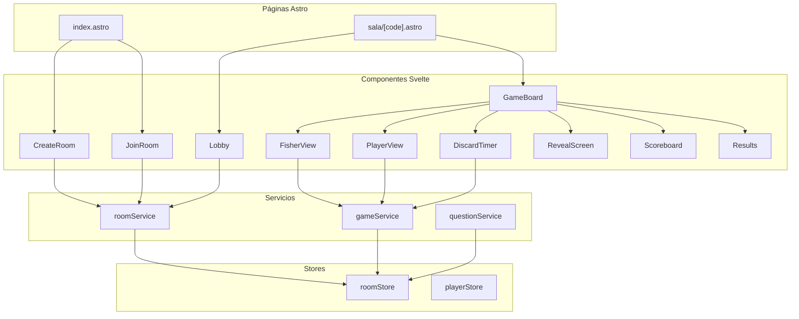
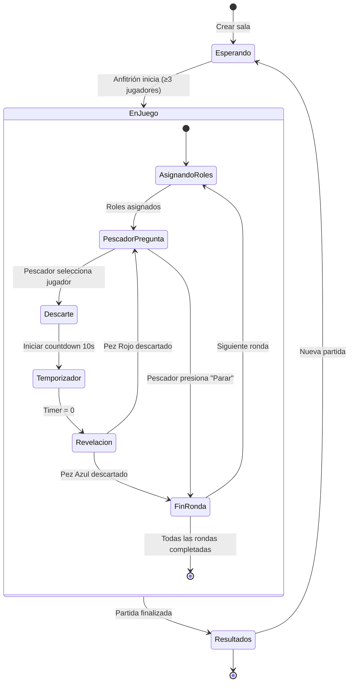
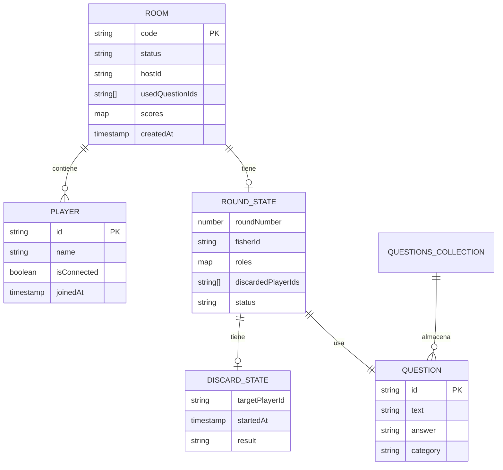

# Documento de Diseño Técnico — Chao Pescao

## Visión General

Chao Pescao es un juego de fiesta multijugador en tiempo real construido con Astro + Svelte + Tailwind CSS v4 en el frontend y Firebase (Firestore + Hosting) en el backend. Los jugadores se conectan desde sus dispositivos móviles a una sala compartida mediante un código de 4 caracteres. El juego se basa en rondas donde un "pescador" rotativo intenta identificar respuestas falsas, mientras los demás jugadores actúan según su rol asignado aleatoriamente (pez rojo = mentir, pez azul = decir la verdad).

La arquitectura es serverless: no hay servidor de aplicación propio. Toda la lógica de estado se gestiona a través de documentos Firestore con listeners en tiempo real (`onSnapshot`). Las transiciones de estado del juego se ejecutan desde el cliente usando transacciones de Firestore para garantizar consistencia.

## Arquitectura

### Diagrama de Arquitectura de Alto Nivel

```mermaid
graph TB
    subgraph "Dispositivos de Jugadores"
        P1[Jugador 1 - Móvil]
        P2[Jugador 2 - Móvil]
        P3[Jugador N - Móvil]
    end

    subgraph "Firebase Hosting"
        APP[Astro + Svelte SPA]
    end

    subgraph "Firebase Firestore"
        ROOMS[(Colección: rooms)]
        QUESTIONS[(Colección: questions)]
    end

    P1 -->|HTTPS| APP
    P2 -->|HTTPS| APP
    P3 -->|HTTPS| APP

    APP -->|onSnapshot listeners| ROOMS
    APP -->|Transacciones| ROOMS
    APP -->|Query| QUESTIONS
```



### Decisiones Arquitectónicas

1. **Sin servidor de aplicación**: Toda la lógica se ejecuta en el cliente. Firestore actúa como fuente de verdad y bus de eventos mediante listeners `onSnapshot`. Esto simplifica el despliegue y elimina costos de servidor.

2. **Transacciones Firestore para consistencia**: Las operaciones críticas (descarte, asignación de roles, cambio de ronda) usan `runTransaction` de Firestore para evitar condiciones de carrera cuando múltiples clientes escriben simultáneamente.

3. **Documento único por sala**: Todo el estado de una sala se almacena en un solo documento Firestore. Esto minimiza las lecturas y simplifica la sincronización — un solo listener por sala.

4. **Astro como shell estático, Svelte como runtime**: Astro genera las páginas estáticas y Svelte maneja toda la interactividad del lado del cliente (estado reactivo, listeners, UI dinámica).

5. **Temporizador en cliente**: El countdown de 10 segundos se ejecuta localmente en cada cliente. El timestamp de inicio del descarte se almacena en Firestore para que todos los clientes sincronicen el temporizador.

## Componentes e Interfaces

### Estructura de Páginas (Astro)

```
src/
├── pages/
│   ├── index.astro          # Pantalla principal: crear/unirse a sala
│   └── sala/
│       └── [code].astro      # Página de sala (lobby + juego)
├── components/
│   ├── CreateRoom.svelte     # Formulario crear sala
│   ├── JoinRoom.svelte       # Formulario unirse con código
│   ├── Lobby.svelte          # Sala de espera con lista de jugadores
│   ├── GameBoard.svelte      # Contenedor principal del juego
│   ├── FisherView.svelte     # Vista del pescador (pregunta + jugadores)
│   ├── PlayerView.svelte     # Vista del jugador (rol + respuesta)
│   ├── DiscardTimer.svelte   # Temporizador de 10 segundos
│   ├── RevealScreen.svelte   # Pantalla de revelación post-descarte
│   ├── Scoreboard.svelte     # Marcador de puntuación
│   └── Results.svelte        # Pantalla de resultados finales
├── lib/
│   ├── firebase.ts           # Inicialización Firebase
│   ├── roomService.ts        # CRUD y lógica de salas
│   ├── gameService.ts        # Lógica de juego (rondas, roles, descarte)
│   ├── questionService.ts    # Consulta de preguntas
│   └── types.ts              # Tipos TypeScript
└── stores/
    ├── roomStore.ts          # Store Svelte reactivo para estado de sala
    └── playerStore.ts        # Store para identidad del jugador local
```

### Diagrama de Componentes



### Interfaces de Servicios

```typescript
// roomService.ts
interface RoomService {
  createRoom(hostName: string): Promise<string>; // retorna roomCode
  joinRoom(roomCode: string, playerName: string): Promise<void>;
  subscribeToRoom(
    roomCode: string,
    callback: (room: Room) => void,
  ): Unsubscribe;
  leaveRoom(roomCode: string, playerId: string): Promise<void>;
}

// gameService.ts
interface GameService {
  startGame(roomCode: string): Promise<void>;
  startRound(roomCode: string): Promise<void>;
  discardPlayer(
    roomCode: string,
    targetPlayerId: string,
  ): Promise<DiscardResult>;
  stopFishing(roomCode: string): Promise<void>;
  nextRound(roomCode: string): Promise<void>;
}

// questionService.ts
interface QuestionService {
  getRandomQuestion(usedQuestionIds: string[]): Promise<Question>;
}
```

### Diagrama de Flujo del Juego



## Modelos de Datos

### Documento de Sala (`rooms/{roomCode}`)

```typescript
interface Room {
  code: string; // Código de 4 caracteres (ej: "A3K9")
  status: "waiting" | "playing" | "finished";
  hostId: string; // ID del jugador anfitrión
  players: Player[]; // Lista ordenada de jugadores
  currentRound: RoundState | null; // Estado de la ronda actual
  usedQuestionIds: string[]; // IDs de preguntas ya usadas
  scores: Record<string, number>; // playerId -> puntos acumulados
  createdAt: Timestamp;
}

interface Player {
  id: string; // ID único generado en cliente
  name: string; // Nombre del jugador
  isConnected: boolean; // Estado de conexión
  joinedAt: Timestamp;
}

interface RoundState {
  roundNumber: number;
  fisherId: string; // ID del pescador de esta ronda
  question: Question; // Pregunta de la ronda
  roles: Record<string, "red" | "blue">; // playerId -> rol asignado
  discardedPlayerIds: string[]; // Jugadores ya descartados en esta ronda
  currentDiscard: DiscardState | null; // Descarte en curso
  status: "assigning" | "fishing" | "discarding" | "revealing" | "ended";
}

interface DiscardState {
  targetPlayerId: string; // Jugador siendo descartado
  startedAt: Timestamp; // Timestamp para sincronizar timer
  result: "red" | "blue" | null; // Resultado (null = pendiente)
}

interface Question {
  id: string;
  text: string; // Texto de la pregunta
  answer: string; // Respuesta correcta
}
```

### Colección de Preguntas (`questions/{questionId}`)

```typescript
interface QuestionDoc {
  id: string;
  text: string;
  answer: string;
  category?: string; // Categoría opcional
}
```

### Store Local del Jugador

```typescript
interface LocalPlayerState {
  playerId: string; // Generado con crypto.randomUUID()
  playerName: string; // Nombre ingresado por el jugador
  currentRoomCode: string | null; // Sala actual
}
```

### Diagrama de Modelo de Datos



### Estrategia de Sincronización en Tiempo Real

La sincronización se basa en un patrón de **documento único + listener**:

1. **Un listener por sala**: Cada cliente suscrito a una sala mantiene un único `onSnapshot` sobre `rooms/{roomCode}`. Cualquier cambio en el documento dispara una actualización reactiva en el store de Svelte.

2. **Escrituras mediante transacciones**: Las operaciones que modifican el estado del juego (descarte, cambio de ronda, asignación de roles) usan `runTransaction` para leer-modificar-escribir atómicamente, evitando conflictos.

3. **Sincronización del temporizador**: El campo `currentDiscard.startedAt` almacena el timestamp del servidor (`serverTimestamp()`). Cada cliente calcula localmente cuánto tiempo ha pasado desde ese timestamp para renderizar el countdown de 10 segundos. Esto evita depender de relojes sincronizados.

4. **Detección de desconexión**: Se usa `onDisconnect()` de Firebase Realtime Database (o un heartbeat periódico en Firestore) para marcar `player.isConnected = false` cuando un jugador pierde conexión.

```typescript
// Ejemplo de suscripción reactiva
import { onSnapshot, doc } from "firebase/firestore";
import { writable } from "svelte/store";

export function subscribeToRoom(roomCode: string) {
  const roomStore = writable<Room | null>(null);

  const unsubscribe = onSnapshot(doc(db, "rooms", roomCode), (snapshot) => {
    if (snapshot.exists()) {
      roomStore.set(snapshot.data() as Room);
    }
  });

  return { roomStore, unsubscribe };
}
```

### Generación de Código de Sala

```typescript
function generateRoomCode(): string {
  const chars = "ABCDEFGHJKLMNPQRSTUVWXYZ23456789"; // Sin I, O, 0, 1 para evitar confusión
  let code = "";
  for (let i = 0; i < 4; i++) {
    code += chars[Math.floor(Math.random() * chars.length)];
  }
  return code;
}
```

Se excluyen caracteres ambiguos (I/1, O/0) para facilitar la lectura del código en persona.

### Asignación Aleatoria de Roles

```typescript
function assignRoles(
  playerIds: string[],
  fisherId: string,
): Record<string, "red" | "blue"> {
  const nonFisherIds = playerIds.filter((id) => id !== fisherId);
  const blueIndex = Math.floor(Math.random() * nonFisherIds.length);

  const roles: Record<string, "red" | "blue"> = {};
  nonFisherIds.forEach((id, index) => {
    roles[id] = index === blueIndex ? "blue" : "red";
  });

  return roles;
}
```

## Propiedades de Correctitud

_Una propiedad es una característica o comportamiento que debe cumplirse en todas las ejecuciones válidas de un sistema — esencialmente, una declaración formal sobre lo que el sistema debe hacer. Las propiedades sirven como puente entre especificaciones legibles por humanos y garantías de correctitud verificables por máquina._

### Propiedad 1: Invariantes de creación de sala

_Para cualquier_ invocación de creación de sala con un nombre de anfitrión válido, el código generado debe tener exactamente 4 caracteres del conjunto alfanumérico permitido (sin I, O, 0, 1), el estado de la sala debe ser "waiting", y el hostId debe coincidir con el ID del jugador creador.

**Valida: Requisitos 1.1, 1.2**

### Propiedad 2: Unirse a sala agrega jugador

_Para cualquier_ sala en estado "waiting" y cualquier jugador nuevo con nombre válido, al unirse a la sala, la lista de jugadores debe contener al nuevo jugador y su longitud debe incrementar en 1.

**Valida: Requisito 2.1**

### Propiedad 3: Validación de unión a sala

_Para cualquier_ intento de unirse a una sala, la operación debe ser rechazada si el código de sala no corresponde a una sala existente O si la sala no está en estado "waiting".

**Valida: Requisitos 2.2, 2.3**

### Propiedad 4: Inicio de partida requiere mínimo de jugadores

_Para cualquier_ sala, la operación de inicio de partida debe tener éxito si y solo si hay al menos 3 jugadores conectados. Con menos de 3, debe ser rechazada.

**Valida: Requisitos 3.1, 3.3**

### Propiedad 5: Completitud de asignación de roles

_Para cualquier_ lista de jugadores y cualquier pescador seleccionado, la función de asignación de roles debe asignar exactamente un Pez_Azul entre los jugadores no-pescador, y todos los demás no-pescadores deben ser Pez_Rojo. El pescador no debe tener rol asignado.

**Valida: Requisitos 4.1, 4.2**

### Propiedad 6: No repetición de preguntas

_Para cualquier_ partida con N rondas, las N preguntas seleccionadas deben ser todas distintas (sin IDs repetidos en usedQuestionIds).

**Valida: Requisitos 5.3, 11.2**

### Propiedad 7: Descarte crea estado válido

_Para cualquier_ descarte de un jugador en una ronda activa, el sistema debe crear un DiscardState con el targetPlayerId correcto y un startedAt con timestamp válido, y el estado de la ronda debe cambiar a "discarding".

**Valida: Requisitos 6.1, 12.1**

### Propiedad 8: Resultado de descarte coincide con rol real

_Para cualquier_ descarte procesado, el resultado revelado (rojo o azul) debe coincidir exactamente con el rol asignado al jugador descartado en la ronda actual.

**Valida: Requisitos 6.3, 12.3**

### Propiedad 9: Puntuación por descarte de Pez Rojo

_Para cualquier_ descarte donde el jugador descartado tiene rol Pez_Rojo, la puntuación del pescador debe incrementar en exactamente 1 punto, y el jugador descartado debe ser agregado a la lista de descartados de la ronda.

**Valida: Requisitos 6.4, 9.3**

### Propiedad 10: Penalización por descarte de Pez Azul

_Para cualquier_ descarte donde el jugador descartado tiene rol Pez_Azul, la puntuación del pescador debe establecerse en 0 puntos y la ronda debe finalizar (estado "ended").

**Valida: Requisitos 6.5, 9.4**

### Propiedad 11: Parar conserva puntuación

_Para cualquier_ ronda activa donde el pescador decide parar, la puntuación del pescador debe permanecer exactamente igual a la que tenía antes de parar, y la ronda debe finalizar.

**Valida: Requisito 7.2**

### Propiedad 12: Rotación cíclica del pescador

_Para cualquier_ lista de jugadores de longitud N y cualquier pescador actual en posición i, el siguiente pescador debe ser el jugador en posición (i + 1) % N.

**Valida: Requisitos 8.1, 8.2**

### Propiedad 13: Completitud del registro de puntuación

_Para cualquier_ sala en estado "playing", el mapa de scores debe contener una entrada para cada jugador de la sala, sin excepciones.

**Valida: Requisito 9.1**

### Propiedad 14: Validez estructural de preguntas

_Para cualquier_ pregunta en el Banco de Preguntas, debe tener un campo text no vacío y un campo answer no vacío.

**Valida: Requisito 11.1**

### Propiedad 15: Ranking de resultados ordenado

_Para cualquier_ mapa de puntuaciones al finalizar una partida, el ranking generado debe estar ordenado de mayor a menor puntuación, y el primer jugador del ranking debe ser el ganador.

**Valida: Requisitos 13.1, 13.2**

## Manejo de Errores

### Errores de Sala

| Escenario                           | Comportamiento                                      | Código de Error        |
| ----------------------------------- | --------------------------------------------------- | ---------------------- |
| Código de sala inexistente          | Mostrar mensaje "La sala no existe"                 | `ROOM_NOT_FOUND`       |
| Sala ya en juego al intentar unirse | Mostrar mensaje "La partida ya está en curso"       | `GAME_ALREADY_STARTED` |
| Iniciar partida con < 3 jugadores   | Mostrar mensaje "Se necesitan al menos 3 jugadores" | `NOT_ENOUGH_PLAYERS`   |
| Código de sala duplicado al crear   | Regenerar código automáticamente (retry)            | —                      |

### Errores de Juego

| Escenario                                  | Comportamiento                             | Código de Error            |
| ------------------------------------------ | ------------------------------------------ | -------------------------- |
| No quedan preguntas disponibles            | Finalizar partida y mostrar resultados     | `NO_QUESTIONS_LEFT`        |
| Descarte de jugador ya descartado          | Ignorar acción (validación en transacción) | `PLAYER_ALREADY_DISCARDED` |
| Acción de no-anfitrión intentando iniciar  | Rechazar operación                         | `NOT_HOST`                 |
| Acción de no-pescador intentando descartar | Rechazar operación                         | `NOT_FISHER`               |

### Errores de Conexión

| Escenario                 | Comportamiento                                                                                    |
| ------------------------- | ------------------------------------------------------------------------------------------------- |
| Jugador pierde conexión   | Marcar `isConnected = false`, mostrar indicador a otros jugadores                                 |
| Jugador reconecta         | Restaurar estado desde Firestore (el listener se re-suscribe automáticamente)                     |
| Anfitrión pierde conexión | El juego continúa; si la sala está en "waiting", los demás jugadores ven indicador de desconexión |

### Validaciones en Transacciones Firestore

Todas las operaciones de escritura críticas se ejecutan dentro de `runTransaction` y validan:

1. Que la sala existe y está en el estado esperado
2. Que el jugador que ejecuta la acción tiene el rol correcto (anfitrión, pescador)
3. Que la transición de estado es válida (ej: no se puede descartar si la ronda ya terminó)
4. Que no hay conflictos de concurrencia (lectura-modificación-escritura atómica)

```typescript
// Ejemplo: descarte con validación
async function discardPlayer(
  roomCode: string,
  targetPlayerId: string,
): Promise<DiscardResult> {
  return runTransaction(db, async (transaction) => {
    const roomRef = doc(db, "rooms", roomCode);
    const roomSnap = await transaction.get(roomRef);

    if (!roomSnap.exists()) throw new Error("ROOM_NOT_FOUND");

    const room = roomSnap.data() as Room;
    if (room.currentRound?.status !== "fishing")
      throw new Error("INVALID_STATE");
    if (room.currentRound.discardedPlayerIds.includes(targetPlayerId)) {
      throw new Error("PLAYER_ALREADY_DISCARDED");
    }

    // Crear estado de descarte
    transaction.update(roomRef, {
      "currentRound.currentDiscard": {
        targetPlayerId,
        startedAt: serverTimestamp(),
        result: null,
      },
      "currentRound.status": "discarding",
    });

    return { targetPlayerId };
  });
}
```

## Estrategia de Testing

### Enfoque Dual: Tests Unitarios + Tests Basados en Propiedades

La estrategia de testing combina dos enfoques complementarios:

- **Tests unitarios**: Verifican ejemplos específicos, casos borde y condiciones de error
- **Tests basados en propiedades**: Verifican propiedades universales con entradas generadas aleatoriamente

Ambos son necesarios: los tests unitarios capturan bugs concretos y los tests de propiedades verifican correctitud general.

### Librería de Property-Based Testing

Se usará **fast-check** (`fc`) como librería de property-based testing para TypeScript/JavaScript. Es la librería más madura del ecosistema y se integra bien con Vitest.

### Configuración

- **Framework de testing**: Vitest
- **Librería PBT**: fast-check
- **Iteraciones mínimas por propiedad**: 100
- **Etiquetado**: Cada test de propiedad debe incluir un comentario con formato:
  `// Feature: chao-pescao, Property {N}: {descripción}`

### Tests Unitarios

Los tests unitarios deben cubrir:

- Ejemplos específicos de creación de sala (código válido, estado inicial correcto)
- Caso borde: intentar unirse a sala inexistente
- Caso borde: intentar unirse a sala en juego
- Caso borde: iniciar partida con 2 jugadores
- Caso borde: agotar todas las preguntas del banco
- Integración: flujo completo de una ronda (asignar roles → descartar → revelar → puntuar)
- Caso borde: pescador descarta al pez azul en primer intento
- Caso borde: pescador para sin descartar a nadie

### Tests Basados en Propiedades

Cada propiedad de correctitud del documento de diseño debe implementarse como un único test basado en propiedades:

| Propiedad                   | Test                                       | Generadores                                                   |
| --------------------------- | ------------------------------------------ | ------------------------------------------------------------- |
| P1: Invariantes de creación | Verificar código 4 chars + estado + hostId | `fc.string()` para nombres                                    |
| P2: Unirse agrega jugador   | Verificar lista crece en 1                 | `fc.array(fc.string())` para jugadores existentes             |
| P3: Validación de unión     | Verificar rechazo en estados inválidos     | `fc.oneof(fc.constant('playing'), fc.constant('finished'))`   |
| P4: Mínimo de jugadores     | Verificar inicio solo con >= 3             | `fc.integer({min: 0, max: 10})` para cantidad                 |
| P5: Asignación de roles     | Verificar exactamente 1 azul, resto rojo   | `fc.array(fc.uuid(), {minLength: 3})` para jugadores          |
| P6: No repetición preguntas | Verificar IDs únicos tras N rondas         | `fc.array(fc.uuid())` para banco de preguntas                 |
| P7: Estado de descarte      | Verificar DiscardState válido              | `fc.uuid()` para targetPlayerId                               |
| P8: Resultado = rol real    | Verificar coincidencia resultado-rol       | `fc.oneof(fc.constant('red'), fc.constant('blue'))`           |
| P9: Puntuación pez rojo     | Verificar +1 punto                         | `fc.integer({min: 0})` para score previo                      |
| P10: Penalización pez azul  | Verificar score = 0 y ronda termina        | `fc.integer({min: 0})` para score previo                      |
| P11: Parar conserva puntos  | Verificar score sin cambio                 | `fc.integer({min: 0})` para score previo                      |
| P12: Rotación pescador      | Verificar (i+1) % N                        | `fc.array(fc.uuid(), {minLength: 3})`, `fc.nat()` para índice |
| P13: Completitud scores     | Verificar todos los jugadores en mapa      | `fc.array(fc.uuid(), {minLength: 3})`                         |
| P14: Validez preguntas      | Verificar text y answer no vacíos          | `fc.record({text: fc.string(), answer: fc.string()})`         |
| P15: Ranking ordenado       | Verificar orden descendente                | `fc.dictionary(fc.uuid(), fc.integer())`                      |

### Ejemplo de Test de Propiedad

```typescript
import { describe, it } from "vitest";
import fc from "fast-check";
import { assignRoles } from "../lib/gameService";

describe("Asignación de roles", () => {
  // Feature: chao-pescao, Property 5: Completitud de asignación de roles
  it("debe asignar exactamente un pez azul y el resto pez rojo", () => {
    fc.assert(
      fc.property(
        fc.uniqueArray(fc.uuid(), { minLength: 3, maxLength: 10 }),
        (playerIds) => {
          const fisherId = playerIds[0];
          const roles = assignRoles(playerIds, fisherId);

          const nonFisherIds = playerIds.filter((id) => id !== fisherId);
          const blueCount = Object.values(roles).filter(
            (r) => r === "blue",
          ).length;
          const redCount = Object.values(roles).filter(
            (r) => r === "red",
          ).length;

          return (
            blueCount === 1 &&
            redCount === nonFisherIds.length - 1 &&
            !(fisherId in roles)
          );
        },
      ),
      { numRuns: 100 },
    );
  });
});
```
